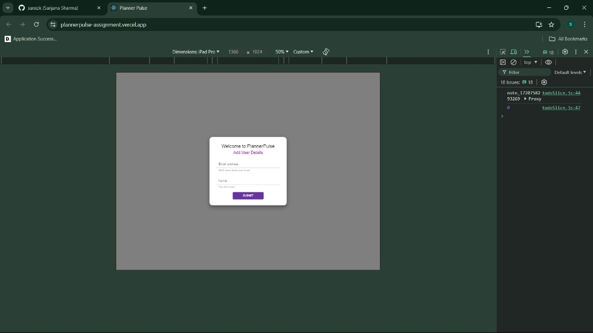

Certainly! Here's your formatted README with corrected spelling and grammar:

---

# PlannerPulse

A todo application to manage daily tasks.

## Demo Link

Visit the [PlannerPulse Demo](https://plannerpulse-assignment.vercel.app/) to see the application in action.

## Basic Outline

- [x] Create a new task
- [x] Delete a task
- [x] Edit a task
- [x] Mark a task as complete

## Technology Used

- [x] React
- [x] Redux Toolkit and React Redux (for state management)
- [x] Material UI
- [x] LocalStorage (as database)

## Steps to Launch the Code and Demo

1. Clone the repository.
2. Run `npm install` to install all dependencies.
3. Run `npm start` to start the application.
4. Open your browser and go to `http://localhost:3000/` to view the application.

## Screenshots

### Mobile View

  

    
  

  

    
  

  

    
  

  

    
  

  

    
  

  

    
  

  

    
  

  

    
  

  

    
  

  

    
  

### Tablet View

  

    
  

  

    
  

  

    
  

### Desktop View

  

    
  

  

    
  

  

    
  

  

    
  

  

    
  

  

    
  

  

    
  

  

    
  

---

This README provides an overview of PlannerPulse, detailing its features, technologies used, how to launch the application, and screenshots showcasing its mobile, tablet, and desktop views.